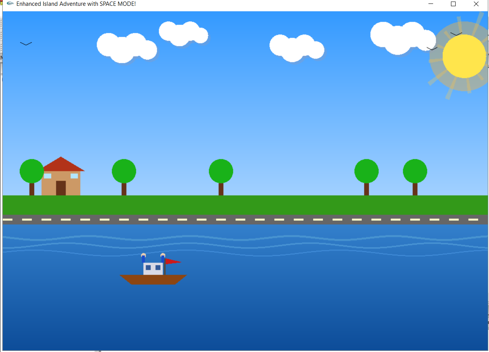
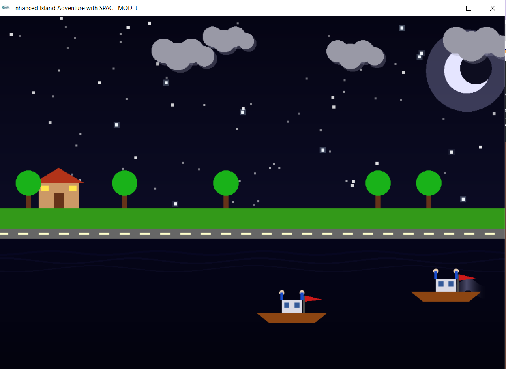
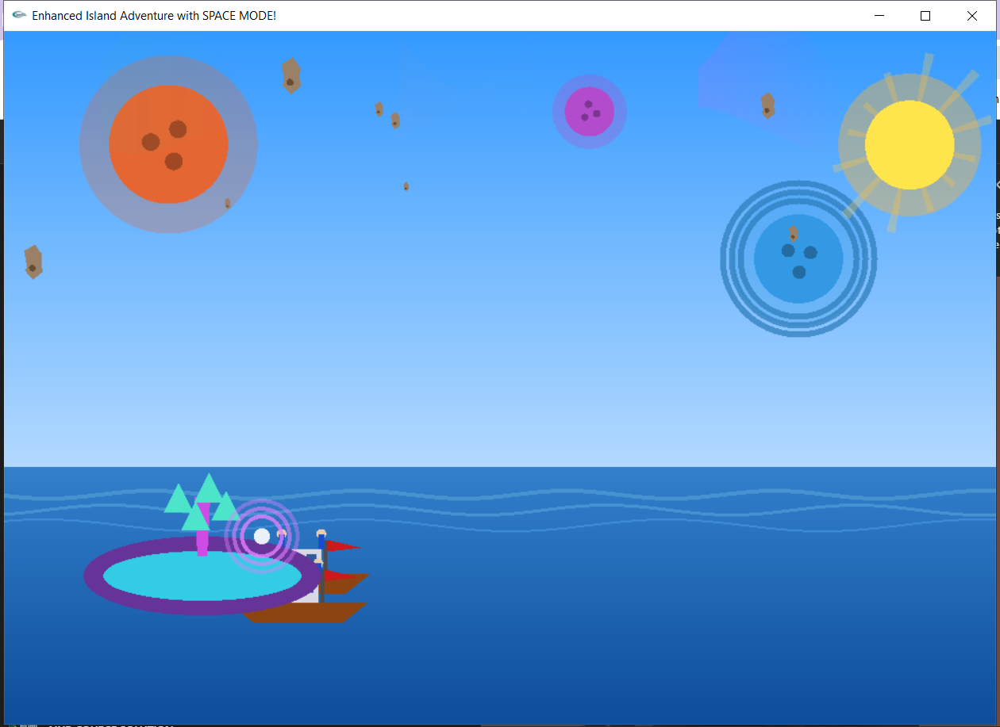

# 🏝️ Finding Island

**Finding Island** is an OpenGL-based simulation project that showcases the versatility and creativity possible with graphics programming.  
Through multiple scenarios, dynamic lighting cycles, natural and man-made environments, and even futuristic space scenes — this project demonstrates how OpenGL can bring virtual worlds to life.

---

## 🌅 Overview

The **Finding Island** project demonstrates the ability of OpenGL to create visually engaging and educational simulations.  
By integrating multiple scenarios, day and night cycles, natural and man-made elements, and futuristic space environments, the project highlights the **versatility of graphics programming**.

One of the most significant achievements of the project is its **modular design**, which ensures:
- **Clarity:** Each component is neatly organized and easy to understand.  
- **Scalability:** New scenes and elements can be added without breaking the system.  
- **Extensibility:** Functions and structs are designed to handle specific elements independently.

The synchronization of animations also demonstrates the **importance of timing and coordination** in graphical systems.

This project serves as:
- A **learning tool** for computer graphics students.
- A **foundation** for interactive entertainment or simulation applications.  
- A bridge between **academic exercises** and **creative storytelling**.

In conclusion, *Finding Island* is more than just a graphics assignment — it is a **comprehensive simulation system** that blends **technical proficiency**, **artistic creativity**, and **practical computer graphics concepts**.

---

## 🧱 Key Features

- 🌞 Dynamic **Day and Night Cycle**
- 🌊 **Natural & Artificial** Elements (trees, houses, boats, etc.)
- 🌌 **Futuristic Space Environment**
- 🧩 **Modular Code Structure** (functions & structs for each component)
- 🌀 **Smooth Animation Synchronization**
- 🎨 **Educational + Visual Showcase** of OpenGL capabilities

---

## 🖼️ Project Previews

You can include screenshots or GIFs here (store them inside a folder like `readme_assets/`):

| Scene | Preview |
|:------|:--------:|
| Daytime Island |  |
| Night Mode |  |
| Space Scene |  |

> 🧩 You can replace these file names once you add actual screenshots to your repository.

---

## ⚙️ Installation & Usage

1. **Clone the repository**
   ```bash
   git clone https://github.com/yourusername/Finding-Island.git
   cd Finding-Island
2.Compile the project
g++ main.cpp -lglut -lGLU -lGL -o FindingIsland

3.Run the executable
./FindingIsland

